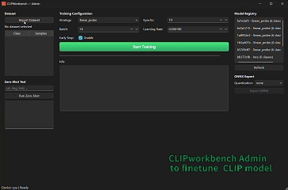
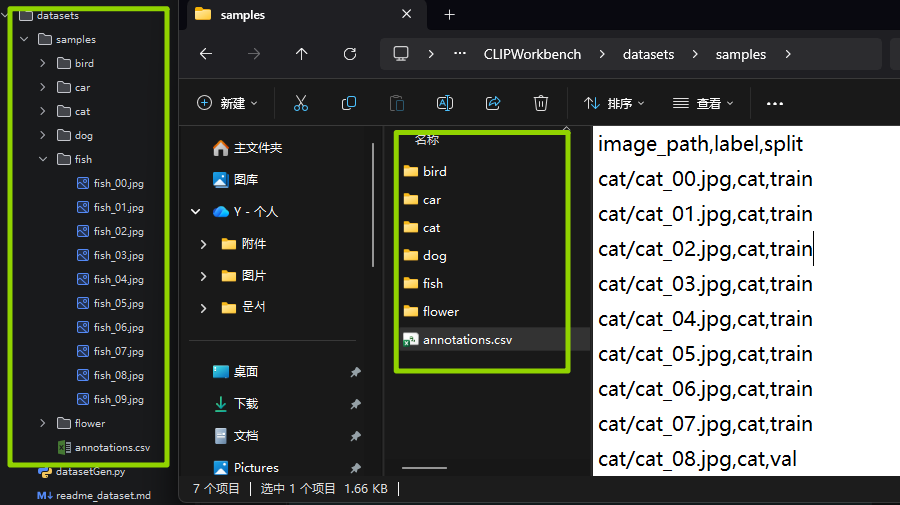

# CLIPWorkbench


> **One core, three shells:** PySide6 desktop, FastAPI HTTP, and CLI for CLIP-based image classification.

CLIPWorkbench is an open-source multimodal AI desktop workbench for training, inferring, and exporting
[CLIP](https://github.com/openai/CLIP)-style vision-language models. It bundles zero-shot classification,
linear-probe and LoRA fine-tuning, ONNX export with FP16/INT8 quantization, and a FastAPI service — all
behind a single shared core so that the desktop GUI, REST API, and command line stay perfectly in sync.


<p align="center">
  
</p>

---

## Features

- **Zero-shot classification** — prompt an unmodified CLIP model with candidate text labels, no training required.
- **Linear probe** — freeze the CLIP vision encoder, train a lightweight linear head for fast adaptation.
- **LoRA fine-tuning** — parameter-efficient adaptation via [PEFT](https://github.com/huggingface/peft) on `q_proj` / `v_proj`.
- **ONNX export & quantization** — ship a single `.onnx` file with optional FP16 / INT8 quantization for CPU acceleration.
- **One core, three shells** — identical logic across PySide6 desktop, FastAPI HTTP, and the `clipworkbench` CLI.
- **uv-managed environment** — one `uv sync` recreates the pinned environment; optional stacks are opt-in extras.
- **ImageFolder + CSV datasets** — drop in a standard ImageFolder directory **or** a CSV annotation file (`image_path,label[,split]`) and start training; the framework auto-detects the format.
- **Background training** — the API runs training as background tasks with live progress polling.
- **Model registry** — SQLite-backed registry tracking model versions, classes, and metrics.
- **Stratified splits + class-imbalance handling** — reproducible train/val splits and inverse-frequency class weights.
- **Mixed-precision (AMP) + early stopping** — efficient training out of the box.
- **Configurable** — all hyperparameters live in a single `configs/default.yaml` mapped to a typed pydantic model.

---

## Architecture

```
                            ┌─────────────────────────────────────────────┐
                            │              CORE (src/clipworkbench)     │
                            │                                             │
                            │  core/      config · schema · exceptions   │
                            │  data/      dataset · storage              │
                            │  models/    clip_loader · inference         │
                            │             linear_probe · lora_finetune    │
                            │             onnx_export · registry         │
                            └───────────────▲───────────────▲───────────┘
                                            │               │
                ┌───────────────────────────┘               └───────────────┐
                │                                                           │
        ┌───────┴────────┐                                          ┌───────┴────────┐
        │   PySide6 GUI   │                                         │   FastAPI API  │
        │  (desktop app)  │                                         │  (HTTP server) │
        └─────────────────┘                                         └────────────────┘
                ▲
                │ shared core calls (predict_image / train_* / export_to_onnx)
                │
        ┌───────┴────────┐
        │     CLI        │   python -m clipworkbench.cli  /  clipworkbench
        └─────────────────┘
```

The three shells (GUI, API, CLI) never reimplement logic — they only call into the core, so behavior is
guaranteed identical everywhere. Heavy third-party stacks stay optional and are pulled in through extras:

| Extra  | Adds                                          | Needed for                                  |
|--------|-----------------------------------------------|---------------------------------------------|
| `gui`  | `PySide6`                                     | `clipworkbench gui`                              |
| `onnx` | `onnx`, `onnxruntime`, `onnxconverter-common` | `clipworkbench export`, ONNX benchmarking        |
| `dev`  | `pytest`, `ruff`, `mypy`                      | local checks and CI                         |
| `all`  | `gui` + `onnx` + `dev`                        | convenience bundle (`uv sync --all-extras`) |

Source layout of the core: `core/` (config · schema · exceptions · task_queue), `data/` (ImageFolder + CSV
dataset loaders · SQLite storage), `models/` (clip_loader · inference · linear_probe · lora_finetune ·
onnx_export · registry), `export/` (ONNX/quantization helpers), `api/` (FastAPI app · routes),
`app/` + `admin/` (PySide6 windows), and `cli.py` (the `clipworkbench` entry point).

---
The environment is managed end to end with [uv](https://docs.astral.sh/uv/): `pyproject.toml` declares the
core dependencies plus optional extras, `uv.lock` pins the exact resolution, `uv sync` materialises `.venv`,
and `uv run <command>` executes everything inside it.

## Requirements

| Requirement | Version  | Notes                                                              |
|-------------|----------|--------------------------------------------------------------------|
| Python      | 3.10+    | uv can install it for you (`uv python install 3.12`); CI runs 3.11 |
| uv          | 0.4+     | creates the venv, syncs dependencies, runs commands                |
| Git         | any      | only needed to clone the repository                                |
| CUDA GPU    | optional | auto-detected when present; CPU-only works out of the box          |

`uv sync` installs the CPU wheel of PyTorch from PyPI. Jump to [GPU / CUDA support](#gpu--cuda-support)
if you want to use an NVIDIA GPU, or to [Docker](#docker) if you prefer containers.

---

## Quick Start

### 1. Install uv

```bash
# macOS / Linux
curl -LsSf https://astral.sh/uv/install.sh | sh
```

```powershell
# Windows (PowerShell)
powershell -ExecutionPolicy ByPass -c "irm https://astral.sh/uv/install.ps1 | iex"
```

Other options: `pipx install uv`, `brew install uv`, or `winget install --id=astral-sh.uv -e`.
Verify the installation with `uv --version`.

### 2. Clone and sync the environment

```bash
git clone https://github.com/<your-org>/CLIPWorkbench.git
cd CLIPWorkbench

uv sync                 # core only: torch, transformers, peft, fastapi, ...
uv sync --extra onnx    # + ONNX export / quantization / benchmarking
uv sync --extra gui     # + PySide6 desktop GUI
uv sync --all-extras    # everything, including the dev toolchain
```

`uv sync` creates `.venv` when needed and installs exactly what `uv.lock` pins, so every machine and CI
runner resolves identical versions. In automation use `uv sync --all-extras --locked` to fail fast instead
of silently re-locking.

### 3. Run everything through `uv run`

```bash
uv run clipworkbench --help                     # console script created by the editable install
uv run python -m clipworkbench --help   # identical CLI through the module entry point
```

`uv run` refreshes the environment before executing, so activating the venv is optional. If you still want
a classic activated shell, use `.venv\Scripts\activate` (Windows) or `source .venv/bin/activate`
(macOS/Linux) and then call `clipworkbench` directly.

### 4. Generate synthetic data or prepare your own real dataset

Dataset is the most important part of the training process to determine the quality of fine-tuned CLIP model.
NOTE: this is only demo dataset for testing purpose, not real dataset.

```bash
uv run python datasets/datasetGen.py
```

This creates **both** an ImageFolder tree and a CSV annotation at `datasets/samples/annotations.csv`
(`image_path,label,split`). Both formats are accepted by the training pipeline — see
[datasets/readme_dataset.md](datasets/readme_dataset.md) for the full dataset preparation guide.

<p align="center">
  
</p>

Note： You are suggested to prepare dateset as per your own scenario to finetune

### 5. Train

```bash
# ImageFolder directory
uv run clipworkbench train --dataset ./datasets/samples --strategy linear_probe --epochs 10

# CSV annotation file (auto-detected from the .csv extension)
uv run clipworkbench train --dataset ./datasets/samples/annotations.csv --strategy linear_probe --epochs 10

# LoRA
uv run clipworkbench train --dataset ./datasets/samples --strategy lora --epochs 5
```

The framework auto-detects the format from the path you pass in — a directory loads as
`ClipImageDataset`, a `.csv` file loads as `ClipCsvDataset`, and downstream training code consumes
them identically (same `class_names`, `samples`, `__getitem__` contract).

The first run downloads `openai/clip-vit-base-patch32` (~600 MB) into `model_cache/`; the fine-tuned model
is written to `saved_models/model_<strategy>/` and registered in the SQLite registry (`clipworkbench.db`).

### 6. Infer

```bash
# Fine-tuned model
uv run clipworkbench infer --image ./photo.jpg --model ./saved_models/model_linear_probe

# Zero-shot (no training needed)
uv run clipworkbench infer --image ./photo.jpg --zero-shot --labels circle_red,circle_blue,square_red
```

### 7. Export to ONNX + benchmark

```bash
uv run clipworkbench export --model ./saved_models/model_linear_probe --quantize int8 --benchmark-runs 200
```

### 8. Serve

```bash
uv run clipworkbench serve --host 0.0.0.0 --port 8000 --reload
# Health:  curl http://localhost:8000/health
# Docs:    http://localhost:8000/docs
```

### 9. Desktop GUI (optional)

```bash
uv sync --extra gui
uv run clipworkbench gui --mode admin   # dataset import, training, model registry, ONNX export
uv run clipworkbench gui --mode app     # single-image inference playground with Top-K table
```

### 10. One-command launchers

Six wrappers in the repository root start each shell without memorising CLI flags. They run from the
repository root, prefer `uv run` (syncing the extra that shell needs), fall back to the `.venv` interpreter
and then to the `python` on `PATH`, and forward every extra argument straight to `clipworkbench`:

| Component                                     | Windows           | Linux / macOS      | Equivalent command                                |
|-----------------------------------------------|-------------------|--------------------|---------------------------------------------------|
| Admin GUI · dataset, training, registry, ONNX | `start_admin.bat` | `./start_admin.sh` | `clipworkbench gui --mode admin`                  |
| App GUI · inference playground, Top-K, batch  | `start_app.bat`   | `./start_app.sh`   | `clipworkbench gui --mode app`                    |
| API · FastAPI service on port 8000            | `start_api.bat`   | `./start_api.sh`   | `clipworkbench serve --host 0.0.0.0 --port 8000`  |

```bash
chmod +x start_*.sh        # once, after cloning (macOS / Linux)

./start_api.sh             # FastAPI on http://localhost:8000  (docs at /docs)
./start_admin.sh           # management window: training, registry, ONNX export
./start_app.sh             # inference window: single image, Top-K, batch

./start_api.sh --port 9000 # extra arguments go to `clipworkbench serve`
CLIPWORKBENCH_RELOAD=1 ./start_api.sh
```

| Variable                | Used by     | Default              | Meaning                                                   |
|-------------------------|-------------|----------------------|-----------------------------------------------------------|
| `CLIPWORKBENCH_EXTRA`   | all         | `gui`, `onnx` (API)  | uv extra to sync; set it empty for core dependencies only |
| `CLIPWORKBENCH_HOST`    | API         | `0.0.0.0`            | bind address                                              |
| `CLIPWORKBENCH_PORT`    | API         | `8000`               | TCP port                                                  |
| `CLIPWORKBENCH_RELOAD`  | API         | off                  | any value except `0` enables uvicorn auto-reload          |
| `CLIPWORKBENCH_NOPAUSE` | `.bat` only | off                  | `1` skips the key press after a failure                   |
| `DEVICE`                | all         | auto                 | `cuda` / `cpu`, read by `get_settings()`                  |

---

## uv cheatsheet

| Task                                         | Command                                                                           |
|----------------------------------------------|-----------------------------------------------------------------------------------|
| Create / refresh `.venv` from the lockfile   | `uv sync`                                                                         |
| Include optional stacks                      | `uv sync --extra onnx` · `uv sync --extra gui` · `uv sync --all-extras`           |
| Reproducible install (CI, no re-lock)        | `uv sync --all-extras --locked`                                                   |
| Run a command inside the environment         | `uv run clipworkbench train --dataset ./dataset_output`                                |
| Run a standalone script                      | `uv run python benchmarks/benchmark.py --model ./saved_models/model_linear_probe` |
| Add or remove a dependency                   | `uv add onnxruntime` · `uv remove onnxruntime`                                    |
| Add a dependency to an extra                 | `uv add --optional onnx onnxconverter-common`                                     |
| Upgrade the lockfile                         | `uv lock --upgrade`                                                               |
| Verify the lockfile matches `pyproject.toml` | `uv lock --check`                                                                 |
| Install a Python interpreter                 | `uv python install 3.12`                                                          |
| Print the interpreter actually used          | `uv run python -c "import sys; print(sys.executable)"`                            |

### GPU / CUDA support

`uv sync` installs the default PyPI wheel of PyTorch (CPU). To use an NVIDIA GPU, reinstall the CUDA build
into the same `.venv` — pick the wheel index that matches your driver (for example `cu124`):

```bash
uv pip install --reinstall torch --index-url https://download.pytorch.org/whl/cu124
uv run python -c "import torch; print(torch.cuda.is_available())"
```

`device: ""` in `configs/default.yaml` then auto-resolves to `cuda`. You can also override it per process
with the `DEVICE` environment variable:

```bash
DEVICE=cuda uv run clipworkbench train --dataset ./dataset_output --strategy lora      # bash
```

```powershell
$env:DEVICE = "cuda"; uv run clipworkbench train --dataset ./dataset_output --strategy lora
```

---

## CLI reference

Every command is available both as the `clipworkbench` console script and as
`uv run python -m clipworkbench <command>`. Print the parser help with `uv run clipworkbench --help`, or the
help of a single command with `uv run clipworkbench <command> --help`.

| Subcommand        | Key flags                                                                                        | Description                                                                       |
|-------------------|--------------------------------------------------------------------------------------------------|-----------------------------------------------------------------------------------|
| `clipworkbench train`  | `--dataset`, `--strategy {linear_probe,lora}`, `--epochs`, `--batch-size`, `--lr`, `--save-path` | Fine-tune on an ImageFolder directory **or** a CSV annotation file and register the result in the model registry |
| `clipworkbench infer`  | `--image`, `--model`, `--zero-shot`, `--labels a,b,c`, `--top-k`, `--temperature`                | Classify one image with a fine-tuned head or with zero-shot text prompts          |
| `clipworkbench export` | `--model`, `--quantize {fp16,int8}`, `--benchmark-runs`                                          | Export the vision encoder + head to ONNX and benchmark ONNX Runtime               |
| `clipworkbench serve`  | `--host`, `--port`, `--reload`                                                                   | Start the FastAPI service with uvicorn                                            |
| `clipworkbench gui`    | `--mode {admin,app}`                                                                             | Launch the PySide6 desktop window                                                 |

### CLI examples

| Task                      | Command                                                                      |
|---------------------------|------------------------------------------------------------------------------|
| Train (ImageFolder)       | `uv run clipworkbench train --dataset ./datasets/samples --strategy linear_probe`       |
| Train (CSV annotation)     | `uv run clipworkbench train --dataset ./datasets/samples/annotations.csv --strategy linear_probe` |
| Train (LoRA)              | `uv run clipworkbench train --dataset ./datasets/samples --strategy lora --epochs 5`    |
| Zero-shot infer           | `uv run clipworkbench infer --image img.jpg --zero-shot --labels cat,dog,bird`    |
| Fine-tuned infer          | `uv run clipworkbench infer --image img.jpg --model ./saved_models/m1`            |
| Export ONNX (INT8)        | `uv run clipworkbench export --model ./saved_models/m1 --quantize int8`           |
| Benchmark PyTorch vs ONNX | `uv run python benchmarks/benchmark.py --model ./saved_models/m1 --runs 200` |
| Start API                 | `uv run clipworkbench serve --port 8000`                                          |
| Start GUI (admin)         | `uv run clipworkbench gui --mode admin`                                           |
| Start GUI (app)           | `uv run clipworkbench gui --mode app`                                                |
---

## API endpoints

| Method | Path                       | Description                                           |
|--------|----------------------------|-------------------------------------------------------|
| `GET`  | `/health`                  | Liveness probe + resolved device (cpu/cuda)           |
| `POST` | `/api/v1/predict`          | Classify an uploaded image (zero-shot or fine-tuned)  |
| `POST` | `/api/v1/embed`            | Compute image embeddings from the CLIP vision encoder |
| `POST` | `/api/v1/finetune`         | Start a background training task                      |
| `GET`  | `/api/v1/status/{task_id}` | Poll training task status / progress                  |
| `GET`  | `/api/v1/tasks`            | List all training tasks                               |
| `GET`  | `/api/v1/models`           | List registered model versions                        |
| `POST` | `/api/v1/export`           | Export a model to ONNX with optional quantization     |
| `POST` | `/api/v1/benchmark`        | Benchmark ONNX Runtime inference latency              |

Interactive docs are auto-generated at `/docs` (Swagger) and `/redoc`.

Example — zero-shot classification (multipart form with `file` + comma-separated `candidate_labels`):

```bash
curl -X POST http://localhost:8000/api/v1/predict \
  -F "file=@./photo.jpg" \
  -F "candidate_labels=circle_red,circle_blue,square_red"
```

Fine-tuned inference uses the same endpoint with `-F "model_path=./saved_models/model_linear_probe"`
instead of `candidate_labels`. Background training is started with `POST /api/v1/finetune`
(`dataset_path`, `strategy`, `model_save_path`, `config_override`) and polled via
`GET /api/v1/status/{task_id}` until `status` becomes `completed`.

---

## Benchmark template

> Numbers below are placeholders. Run
> `uv run python benchmarks/benchmark.py --model ./saved_models/model_linear_probe --runs 200`
> on your hardware and replace them.

| Strategy     | Top-1 Acc | Latency (mean) | Model Size | Notes                          |
|--------------|-----------|----------------|------------|--------------------------------|
| Zero-shot    | —         | _ms_           | ~600 MB    | No training; text prompts only |
| Linear Probe | _%_       | _ms_           | ~600 MB    | Frozen encoder + tiny head     |
| LoRA (r=8)   | _%_       | _ms_           | ~600 MB    | PEFT adapter, merges into base |
| ONNX (FP32)  | _%_       | _ms_           | ~_ MB      | Cross-platform, fixed graph    |
| ONNX INT8    | _%_       | _ms_           | ~_ MB      | Dynamic INT8 quantization      |

---

## Project structure

```
CLIPWorkbench/
├── src/clipworkbench/
│   ├── core/            config · schema · exceptions · task_queue
│   ├── data/            dataset · storage
│   ├── models/          clip_loader · inference · linear_probe
│   │                    lora_finetune · onnx_export · registry
│   ├── export/          quantize (ONNX / FP16 / INT8 helpers)
│   ├── api/             FastAPI app · routes
│   ├── app/             PySide6 inference window
│   ├── admin/           PySide6 training / registry / export window
│   ├── cli.py           clipworkbench entry point
│   └── __main__.py      python -m clipworkbench
├── configs/             default.yaml
├── tests/               test_dataset.py · test_schema.py
├── benchmarks/          benchmark.py (PyTorch vs ONNX)
├── datasets/            datasetGen.py · readme_dataset.md · samples/ (git-ignored output)
├── docker/              Dockerfile · docker-compose.yml
├── start_admin.bat/.sh   launchers · admin GUI (training, registry, ONNX export)
├── start_app.bat/.sh     launchers · app GUI (inference, Top-K, batch)
├── start_api.bat/.sh     launchers · FastAPI service (uvicorn, port 8000)
├── .github/workflows/   ci.yml (lint · typecheck · test)
├── pyproject.toml       package metadata + extras (gui · onnx · dev)
├── uv.lock              pinned resolution consumed by `uv sync`
├── CHANGELOG.md         release notes · rename history
├── LICENSE
└── README.md
```

Runtime artifacts are git-ignored: `model_cache/` (downloaded CLIP weights), `saved_models/` (fine-tuned
models), `onnx_models/` (ONNX exports) and `clipworkbench.db` (SQLite registry).

---

## Naming

One brand, one name per layer, so a single search for `clipworkbench` finds everything:

| Layer                              | Identifier             |
|------------------------------------|------------------------|
| Repository, GitHub, display name   | `CLIPWorkbench`        |
| PyPI distribution (`[project].name`)| `clipworkbench`       |
| Python import package (`src/`)     | `clipworkbench`        |
| CLI console script                 | `clipworkbench`        |
| Environment variables (`start_*`)  | `CLIPWORKBENCH_*`      |
| SQLite registry                    | `clipworkbench.db`     |

The project was consolidated onto these names before its first release, and no backwards-compatibility
shim is shipped: scripts import `clipworkbench` and call the `clipworkbench` CLI. Saved fine-tuned models
and ONNX exports are unaffected because no package name is persisted inside them, and the SQLite table
names (`models` · `predictions` · `corrections`) are unchanged.

The superseded names, plus what to change in existing scripts and databases, are recorded in
[CHANGELOG.md](CHANGELOG.md).

---

## Configuration

All runtime settings live in `configs/default.yaml` and map directly onto the typed `Settings` pydantic
model (`clipworkbench.core.config`). Editing the YAML is enough; no code changes are required.

```yaml
# CLIP model configuration
model:
  name: "openai/clip-vit-base-patch32"  # Base model for CLIP
  local_cache_dir: "./model_cache"
  image_size: 224   # Input image size for CLIP model

### Training hyperparameters
# fundamental training hyperparameters shown on admin GUI
# advanced training hyperparameters hidden from admin GUI (for expert users)
  batch_size: 16
  learning_rate: 0.0001
  num_epochs: 20
  warmup_steps: 20
  logging_steps: 10
  val_split: 0.15
  weight_decay: 0.01
  gradient_accumulation_steps: 1
  use_amp: true
  use_early_stopping: true
  patience: 5
  delta: 0.0001
  linear_probe_epochs: 10
  lora_r: 8
  lora_alpha: 16
  lora_dropout: 0.1
  lora_target_modules: ["q_proj", "v_proj"]
  inference_temperature: 1.0
  top_k: 5

# Storage paths
storage:
  models_dir: "./saved_models"
  onnx_dir: "./onnx_models"
  db_path: "./clipworkbench.db"

# Device override (empty = auto-detect CUDA/CPU)
device: ""
```

Load it programmatically:

```python
from clipworkbench.core.config import get_settings

settings = get_settings()          # reads ./configs/default.yaml (or ./config.yaml)
print(settings.model.name)         # openai/clip-vit-base-patch32
print(settings.resolved_device)    # cuda | cpu
```

```bash
# the same call, executed inside the uv environment
uv run python -c "from clipworkbench.core.config import get_settings; print(get_settings().resolved_device)"
```

`get_settings()` is cached, looks for `configs/default.yaml` relative to the current working directory, and
creates `models_dir` / `onnx_dir` on the first call. Environment variables win over the YAML for top-level
fields, which is exactly how `DEVICE=cpu` in `docker-compose.yml` reaches the app.

---

## Docker

The API service ships with a container image so you can run it without touching your local Python:

```bash
cd docker
docker compose up --build
# API now live at http://localhost:8000
```

`docker/Dockerfile` builds on `python:3.11-slim`, installs the project with the `onnx` extra, and starts
uvicorn on port 8000. `docker-compose.yml` pins `DEVICE=cpu` and mounts the named volumes `model_cache`
and `saved_models`, so downloaded weights and trained models survive container restarts.

The image installs dependencies with `pip install -e ".[onnx]"`; the uv workflow described above is for
local development. Prefer to skip Docker? The same service runs locally with `uv run clipworkbench serve`.

---

## Development

```bash
uv sync --all-extras                 # gui + onnx + dev toolchain
uv run ruff check src/               # lint
uv run ruff format --check src/      # formatting
uv run mypy src/                     # type check
uv run pytest tests/ -v              # unit tests
```

The GitHub Actions workflow (`.github/workflows/ci.yml`) runs the same three stages on Python 3.11 — ruff
lint + format check, mypy, and pytest. The unit tests (`tests/test_dataset.py`, `tests/test_schema.py`)
never download model weights, so any synced environment that includes the `dev` extra can run them.

When you add a dependency, let uv update `pyproject.toml` and `uv.lock` together:

```bash
uv add onnxruntime                            # runtime dependency
uv add --optional onnx onnxconverter-common   # dependency of an optional extra
uv remove onnxruntime
```

---

## Use cases

CLIPWorkbench is model-agnostic about *what* you classify — only the images change.

- **Industrial inspection** — sort defect / OK parts on the production line with a few labeled photos and
  zero-shot text prompts ("a photo of a scratched surface", "a photo of a clean surface").
- **Medical imaging** — adapt CLIP to dermatology, radiology, or microscopy thumbnails via linear probe or
  LoRA without large annotated corpora.
- **Scientific imagery** — biology, geology, and materials science datasets where classes are visual but
  data is scarce; ONNX INT8 lets you ship the classifier next to the acquisition software.
- **Education & prototyping** — generate the synthetic dataset, train in minutes, and export a single
  portable `.onnx` for demos and course labs.

---

## Roadmap

- [ ] Streaming dataset ingestion for very large image folders
- [ ] Zero-shot prompt-template tuning
- [ ] INT8 calibration (currently dynamic) for tighter accuracy/size trade-offs
- [ ] Batched / async API inference with a request queue
- [ ] Experiment tracking (metrics + params history in the SQLite registry)
- [ ] Multi-GPU LoRA training
- [ ] PySide6 GUI polish: dataset explorer, training charts, ONNX preview
- [ ] uv-native container image and CI (`uv sync --locked` in `.github/workflows/ci.yml`)

## Roadmap to do for advanced functions
- [ ] TBD

---

## License

Released under the [MIT License](LICENSE).
Copyright © 2026 JunSu-AI's CLIPWorkbench Contributors.